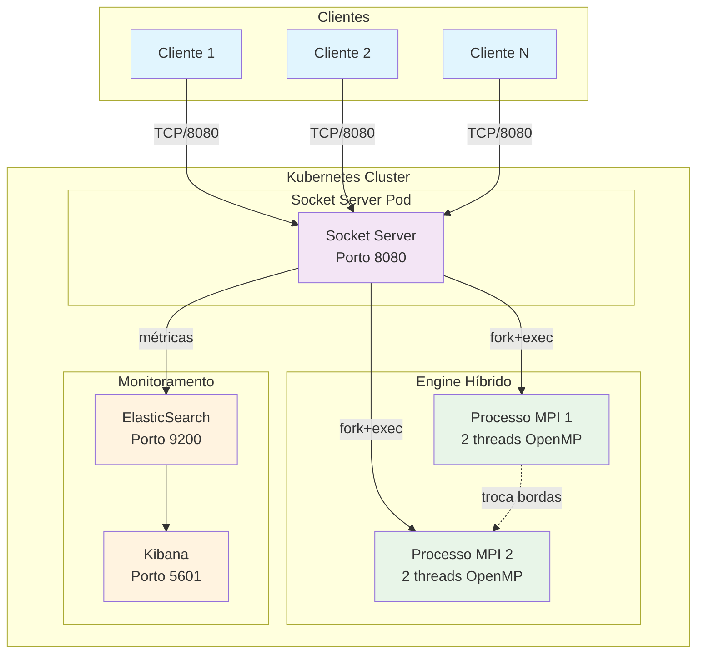

# Jogo da Vida Distribuído

> **Implementação distribuída e paralela do Jogo da Vida de Conway usando OpenMP+MPI, Kubernetes e ElasticSearch/Kibana**

[](https://kubernetes.io/)
[](https://docker.com/)
[](https://www.openmp.org/)
[](https://www.mpi-forum.org/)
[](https://www.elastic.co/)

## 📋 Visão Geral

Este projeto implementa o **Jogo da Vida de Conway** como uma aplicação distribuída de alta performance, combinando:

- **Paralelização Híbrida**: OpenMP + MPI (2 processos × 2 threads = 4 núcleos)
- **Orquestração**: Kubernetes com autoscaling automático
- **Monitoramento**: ElasticSearch + Kibana para métricas em tempo real
- **Interface**: Socket Server para múltiplos clientes simultâneos
- **Performance**: Otimizações avançadas de CPU e memória

## Arquitetura do Sistema



## Pré-requisitos

### Software Necessário

```bash
# Atualizar sistema
sudo apt-get update

# Compiladores e bibliotecas
sudo apt-get install -y \
    gcc libc6-dev libgomp1 \
    libcurl4-openssl-dev libjson-c-dev \
    openmpi-bin openmpi-common libopenmpi-dev

# Docker
sudo apt-get install -y docker.io
sudo usermod -aG docker $USER
newgrp docker

# Kind (Kubernetes local)
curl -Lo ./kind https://kind.sigs.k8s.io/dl/v0.20.0/kind-linux-amd64
chmod +x ./kind && sudo mv ./kind /usr/local/bin/kind

# kubectl
curl -LO "https://dl.k8s.io/release/$(curl -L -s https://dl.k8s.io/release/stable.txt)/bin/linux/amd64/kubectl"
chmod +x kubectl && sudo mv kubectl /usr/local/bin/
```

## 📁 Estrutura do Projeto

```
projeto/
├── src/
│   ├── core/
│   │   ├── jogodavida_openmp_mpi.c    # Engine híbrida OpenMP+MPI
│   │   ├── socket_server.c            # Socket server (versão local)
│   │   ├── test_client.c              # Cliente de teste
│   │   └── Dockerfile                 # Container da aplicação
│   └── kubernetes/
│       ├── kind-cluster-config.yaml   # Configuração do cluster
│       ├── elasticsearch.yaml         # Deploy do ElasticSearch
│       ├── kibana.yaml                # Deploy do Kibana
│       ├── socket-server.yaml         # Deploy do socket server
│       └── service-account.yaml       # Usuário do dashboard
├── binarios/                          # Executáveis compilados
├── .gitignore
└── README.md
```

## Setup Rápido: Passo a Passo

```bash
# 1. Compilar aplicação
mkdir -p binarios
mpicc -o binarios/jogodavida_openmp_mpi src/core/jogodavida_openmp_mpi.c -fopenmp -lm -O3
gcc -o binarios/socket_server src/core/socket_server.c -lcurl -ljson-c -lpthread -O3
gcc -o binarios/test_client src/core/test_client.c -O3

# 2. Testar localmente (opcional)
mpirun -np 2 ./binarios/jogodavida_openmp_mpi --powmin 3 --powmax 5

# 3. Criar cluster Kubernetes
kind create cluster --config=src/kubernetes/kind-cluster-config.yaml
kubectl create namespace gameoflife

# 4. Build Docker
cp src/core/jogodavida_openmp_mpi.c src/core/socket_server.c src/core/
docker build -t gameoflife/socket-server:latest -f src/core/Dockerfile src/core/
kind load docker-image gameoflife/socket-server:latest --name gameoflife-cluster-optimized

# 5. Deploy aplicação
kubectl apply -f src/kubernetes/elasticsearch.yaml
kubectl apply -f src/kubernetes/kibana.yaml
kubectl apply -f src/kubernetes/socket-server.yaml

# 6. Aguardar pods ficarem prontos
kubectl wait --for=condition=ready pod -l app=elasticsearch -n gameoflife --timeout=300s
kubectl wait --for=condition=ready pod -l app=socket-server -n gameoflife --timeout=300s
```

## Testes e Uso

### Teste Básico

```bash
# Teste rápido (segundos)
./binarios/test_client -e openmp_mpi -min 3 -max 5

# Saída esperada:
# MODO KUBERNETES - Conectando ao cluster na porta 30080
# Paralelização: 2 processos MPI x 2 threads OpenMP = 4 cores
# Conectado! Enviando requisição...
# Execução concluída com sucesso!
```

### Testes de Performance

```bash
# Teste médio (30-60 segundos)
./binarios/test_client -e openmp_mpi -min 3 -max 7

# Teste pesado (vários minutos)
./binarios/test_client -e openmp_mpi -min 3 -max 8
```

### Teste de Carga (Múltiplos Clientes)

```bash
# Simular 5 clientes simultâneos
for i in {1..5}; do
    ./binarios/test_client -e openmp_mpi -min 3 -max 4 &
done
wait

# Ver autoscaling em ação
kubectl get pods -n gameoflife -w
```

### Teste Manual via Netcat

```bash
# Conectar diretamente ao socket
echo "ENGINE:openmp_mpi;POWMIN:3;POWMAX:5" | nc localhost 30080
```

## 🔌 Protocolo de Comunicação

### Formato da Requisição
```
ENGINE:openmp_mpi;POWMIN:3;POWMAX:5
```

### Formato da Resposta
```
REQUEST_ID:123
STATUS:SUCCESS
ENGINE:openmp-mpi-container
PROCESSES:2
THREADS:2
EXECUTION_TIME:1.234567
TOTAL_TIME:2.345678
RESULTS:
Game of Life MPI/OpenMP: 2 processos MPI x 2 threads OpenMP
Parâmetros: POWMIN=3, POWMAX=5
================================================================
**Ok, RESULTADO CORRETO**
tam=8; procs=2; threads=2; tempos: init=0.0001234, comp=0.0012345, fim=0.0000123, tot=0.0013702
**Ok, RESULTADO CORRETO**
tam=16; procs=2; threads=2; tempos: init=0.0002345, comp=0.0034567, fim=0.0000234, tot=0.0037146
**Ok, RESULTADO CORRETO**
tam=32; procs=2; threads=2; tempos: init=0.0003456, comp=0.0123456, fim=0.0000345, tot=0.0127257
END_OF_RESPONSE
```

## 📊 Monitoramento e Dashboards

### Interfaces Web Disponíveis

```bash
# ElasticSearch API
curl -X GET "localhost:30200/gameoflife-requests/_search?pretty"

# Acessar Kibana Dashboard
echo "Kibana: http://localhost:31502"

# Kubernetes Dashboard (se instalado com os passos abaixo)
kubectl apply -f https://raw.githubusercontent.com/kubernetes/dashboard/v2.7.0/aio/deploy/recommended.yaml
kubectl apply -f src/kubernetes/service-account.yaml
kubectl patch svc kubernetes-dashboard -n kubernetes-dashboard \
  -p '{"spec":{"type":"NodePort","ports":[{"port":443,"targetPort":8443,"nodePort":30000}]}}'

# Gerar token de acesso
kubectl -n kubernetes-dashboard create token admin-user
echo "Dashboard K8s: https://localhost:30000"
```

### Configurar Kibana
1. Acesse http://localhost:31502
2. Crie pattern: `gameoflife-requests*`
3. Use `@timestamp` como campo de tempo
4. Vá em **Analytics > Discover** para ver métricas

### Queries Úteis no ElasticSearch

```bash
# Ver últimos requests
curl -X GET "localhost:30200/gameoflife-requests/_search?pretty&size=10&sort=@timestamp:desc"

# Estatísticas por cliente
curl -X GET "localhost:30200/gameoflife-requests/_search?pretty" -H 'Content-Type: application/json' -d'
{
  "aggs": {
    "por_cliente": {
      "terms": {
        "field": "client_ip.keyword"
      }
    }
  }
}'

# Tempo médio de execução
curl -X GET "localhost:30200/gameoflife-requests/_search?pretty" -H 'Content-Type: application/json' -d'
{
  "aggs": {
    "tempo_medio": {
      "avg": {
        "field": "execution_time_seconds"
      }
    }
  }
}'
```

## Performance e Limites
### Tempos de execução
#### OpenMP/MPI
| POWMAX | Tamanho  | Tempo Estimado      |
|--------|----------|---------------------|
| 4      | 16×16    | ~0.0056598 segundos |
| 5      | 32×32    | ~0.0072370 segundos |
| 6      | 64×64    | ~0.0108290 segundos |
| 7      | 128×128  | ~0.0194170 segundos |
| 8      | 256×256  | ~0.0717611 segundos |
| 9      | 512×512  | ~0.4564989 segundos |
| 10     | 1024×1024| ~4.3597231 segundos |

#### OpenMP/MPI
| POWMAX  | Tamanho  | Tempo Estimado |
|---------|----------|----------------|
|PREENCHER|PREENCHER |PREENCHER       |

### Otimizações Implementadas

- **Cluster**: etcd 8GB, API server 800 req/s, scheduler QPS 100
- **Pods**: 8GB RAM, 4 CPUs, volumes em memória (/dev/shm)
- **Engine**: flags `-O3 -march=native -flto`, NUMA awareness
- **Network**: kubeProxyMode ipvs, CNI otimizado

## 🔧 Comandos de Desenvolvimento

### Rebuild Rápido

```bash
# Recompilar e redesenvolver
gcc -o binarios/socket_server src/core/socket_server.c -lcurl -ljson-c -lpthread -O3
cp src/core/jogodavida_openmp_mpi.c src/core/socket_server.c src/core/
docker build -t gameoflife/socket-server:latest -f src/core/Dockerfile src/core/ --no-cache
kind load docker-image gameoflife/socket-server:latest --name gameoflife-cluster-optimized
kubectl rollout restart deployment/socket-server -n gameoflife
```

### Debug e Monitoramento

```bash
# Status geral
kubectl get all -n gameoflife

# Logs em tempo real
kubectl logs -n gameoflife deployment/socket-server -f

# Entrar no container
kubectl exec -it deployment/socket-server -n gameoflife -- /bin/bash

# Verificar recursos
kubectl top pods -n gameoflife
kubectl top nodes

# Testar engine dentro do container
kubectl exec -it deployment/socket-server -n gameoflife -- \
  mpirun -np 2 --allow-run-as-root /app/jogodavida_openmp_mpi --powmin 3 --powmax 4
```

### Limpeza Completa

```bash
# Parar e remover tudo
kubectl delete namespace gameoflife
kind delete cluster --name gameoflife-cluster-optimized
docker system prune -f
rm -rf binarios/
```

## 🏆 Funcionalidades Avançadas

### Autoscaling Automático

O sistema possui HPA (Horizontal Pod Autoscaler) configurado:

```bash
# Verificar autoscaling
kubectl get hpa -n gameoflife

# Simular carga para testar
for i in {1..20}; do
    ./binarios/test_client -e openmp_mpi -min 3 -max 4 &
done

# Observar pods sendo criados
kubectl get pods -n gameoflife -w
```

### Métricas Customizadas

O sistema coleta automaticamente:
- Tempo de execução por requisição
- IP dos clientes
- Status de sucesso/erro
- Tipo de engine utilizada
- Número de processos e threads

### Load Balancing

O Kubernetes distribui automaticamente requisições entre múltiplas instâncias do socket-server quando há alta carga.

## 📚 Referências e Documentação

- [Conway's Game of Life](https://en.wikipedia.org/wiki/Conway%27s_Game_of_Life)
- [OpenMP Documentation](https://www.openmp.org/)
- [MPI Standard](https://www.mpi-forum.org/)
- [Kubernetes Documentation](https://kubernetes.io/docs/)
- [ElasticSearch Guide](https://www.elastic.co/guide/)
- [Kind Documentation](https://kind.sigs.k8s.io/)

## 📄 Licença

Este projeto é desenvolvido para fins acadêmicos na disciplina **PSPD - Programação para Sistemas Paralelos e Distribuídos**, Universidade de Brasília.